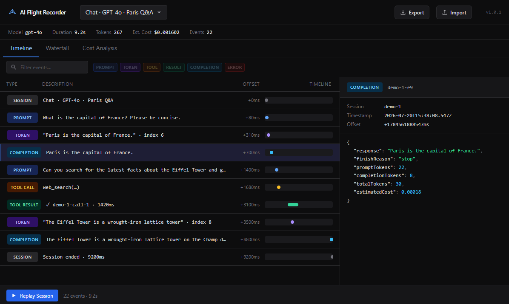

# AI Flight Recorder

> Chrome DevTools for AI Applications

AI Flight Recorder is an open-source developer tool for recording, replaying, and inspecting every interaction in an AI application — prompts, streamed tokens, tool calls, latency, and cost — all in one place.

Instead of piecing together console logs after the fact, you drop in a one-line SDK wrapper and get a full DevTools-style timeline you can pause, rewind, and hand off to a teammate as a `.flight` file.

[](https://github.com/AllThingsSmitty/ai-flight-recorder/actions/workflows/ci.yml)



## Features

- **Session recording:** capture every prompt, token, tool call, and completion as a structured event stream
- **Streaming replay:** watch a session play back in real time with speed controls (0.25×–8×)
- **Timeline & Waterfall:** visualize the full request lifecycle including parallel tool calls and streaming latency
- **Cost Analysis:** break down token usage and estimated spend per session
- **Search & Filter:** filter events by type or keyword across the full timeline
- **Provider Adapters:** one-line wrappers for OpenAI, Anthropic, and Google Gemini (streaming and non-streaming)
- **`.flight` Export/Import:** share a session as a portable file another developer can replay locally
- **Plugin System:** hook into the recorder lifecycle with custom observers
- **Transport System:** plug in any storage backend (in-memory, filesystem, your own API)

## Repository Structure

```
ai-flight-recorder/
├── apps/
│   └── devtools/          Next.js DevTools application
├── packages/
│   ├── core/              Domain model — events, session, recorder, replay engine
│   ├── sdk/               Developer-facing API — FlightRecorder, adapters, plugins, transports
│   ├── ui/                Shared React components (future)
│   └── types/             Shared TypeScript types (future)
├── scripts/
│   └── smoke.ts           SDK integration smoke test
└── examples/
    └── nextjs-chat/       Full-stack chat app — OpenAI streaming + .flight export
```

## Getting Started

### Prerequisites

- Node.js 18+
- pnpm 9+

### Install dependencies

```bash
pnpm install
```

### Run the DevTools app

```bash
pnpm dev
```

Open [http://localhost:3000](http://localhost:3000). The app loads with two demo sessions so you can explore the UI immediately — no API keys required.

### Run the SDK smoke test

```bash
pnpm smoke
```

Exercises recording, plugins, transport, serialization, and replay end-to-end. All 19 assertions should pass.

## SDK Usage

### Basic recording

```ts
import { FlightRecorder } from "@ai-flight-recorder/sdk";

const fr = new FlightRecorder();
const session = fr.startSession({ label: "my-chat" });

fr.record({
  type: "prompt",
  model: "gpt-4o",
  prompt: "What is the capital of France?",
});
fr.record({
  type: "completion",
  response: "Paris.",
  finishReason: "stop",
  totalTokens: 18,
});

const ended = fr.endSession();
```

### Provider adapters

Drop-in wrappers that intercept the provider client and record every call automatically.

**OpenAI**

```ts
import OpenAI from "openai";
import { FlightRecorder, wrapOpenAI } from "@ai-flight-recorder/sdk";

const fr = new FlightRecorder();
const openai = wrapOpenAI(new OpenAI(), fr.recorder);

fr.startSession({ label: "chat" });

const response = await openai.chat.completions.create({
  model: "gpt-4o",
  messages: [{ role: "user", content: "Hello" }],
});

fr.endSession();
```

**Anthropic**

```ts
import Anthropic from "@anthropic-ai/sdk";
import { FlightRecorder, wrapAnthropic } from "@ai-flight-recorder/sdk";

const fr = new FlightRecorder();
const client = wrapAnthropic(new Anthropic(), fr.recorder);

fr.startSession({ label: "claude-chat" });

const message = await client.messages.create({
  model: "claude-sonnet-4-5",
  max_tokens: 1024,
  messages: [{ role: "user", content: "Hello" }],
});

fr.endSession();
```

**Google Gemini**

```ts
import { GoogleGenerativeAI } from "@google/generative-ai";
import { FlightRecorder, wrapGeminiModel } from "@ai-flight-recorder/sdk";

const fr = new FlightRecorder();
const genAI = new GoogleGenerativeAI(process.env.GOOGLE_API_KEY!);
const model = wrapGeminiModel(
  genAI.getGenerativeModel({ model: "gemini-1.5-pro" }),
  fr.recorder,
);

fr.startSession({ label: "gemini-chat" });
const result = await model.generateContent("Hello");
fr.endSession();
```

All three adapters support streaming. Wrap your existing client and all calls are recorded automatically.

### Plugins

```ts
import { FlightRecorder, ConsoleLogPlugin } from "@ai-flight-recorder/sdk";

const fr = new FlightRecorder({
  plugins: [
    new ConsoleLogPlugin({ logEvents: true, logSummary: true }),

    // Inline plugin
    {
      name: "my-plugin",
      onSessionStart: (session) => console.log("Started:", session.id),
      onEvent: (event) => myMetrics.record(event),
      onSessionEnd: (session) => alerting.flush(session),
    },
  ],
});
```

`use()` is chainable and checks for duplicate names at registration time:

```ts
fr.use(pluginA).use(pluginB);
```

### Transport

```ts
import { FlightRecorder, InMemoryTransport } from "@ai-flight-recorder/sdk";

const transport = new InMemoryTransport();

const fr = new FlightRecorder({ transport });

fr.startSession();
// ... record events ...
fr.endSession(); // automatically saves to transport

const sessions = transport.getAll();
```

**Node.js filesystem transport:**

```ts
import { FlightRecorder } from "@ai-flight-recorder/sdk";
import { FileTransport } from "@ai-flight-recorder/sdk/node";

const transport = new FileTransport("./recordings");
const fr = new FlightRecorder({ transport });

fr.startSession({ label: "my-session" });
// ... record events ...
fr.endSession();
// saves to ./recordings/<sessionId>.flight

const sessions = transport.loadAll();
```

### Implement your own transport

```ts
import type { Transport } from "@ai-flight-recorder/sdk";

class MyApiTransport implements Transport {
  async save(session) {
    await fetch("/api/sessions", {
      method: "POST",
      body: JSON.stringify(session),
    });
  }
}

const fr = new FlightRecorder({ transport: new MyApiTransport() });
```

## `.flight` File Format

Sessions can be exported as portable `.flight` files (JSON with a version envelope):

```json
{
  "version": "1",
  "exportedAt": 1721484000000,
  "session": {
    "id": "...",
    "label": "bug-report-123",
    "status": "ended",
    "startedAt": 1721484000000,
    "endedAt": 1721484060000,
    "events": [ ... ]
  }
}
```

**Export from the DevTools UI:** click the Export button in the toolbar while a session is active.

**Import into the DevTools UI:** click Import and select a `.flight` file. The session is added to the session list and becomes the active session immediately.

**Programmatic export/import:**

```ts
import { serializeSession, deserializeSession } from "@ai-flight-recorder/sdk";
import { writeFileSync, readFileSync } from "node:fs";

// Export
writeFileSync("bug-123.flight", serializeSession(endedSession));

// Import
const session = deserializeSession(readFileSync("bug-123.flight", "utf-8"));
```

## DevTools Application

The DevTools app (`apps/devtools`) is a Next.js application providing a visual interface for recorded sessions.

**Tabs:**

- **Timeline:** chronological event list with type badges, descriptions, and timing offsets
- **Waterfall:** visual latency breakdown showing streaming spans and tool call durations
- **Cost Analysis:** token usage breakdown and estimated spend per request

**Replay:**

- Click "Replay Session" to enter replay mode
- Speed controls: 0.25×, 0.5×, 1×, 2×, 4×, 8×
- Seek bar for jumping to any point in the session
- Token stream assembles in real time as tokens replay

**Search:**

- Filter by event type using the chip row (Prompt, Token, Tool, Result, Completion, Error)
- Text search across event content

## Example: Next.js Chat

`examples/nextjs-chat` is a minimal Next.js app showing a full end-to-end integration — streaming chat with GPT-4o-mini, automatic session recording, and `.flight` export.

### Setup

```bash
cd examples/nextjs-chat
cp .env.example .env.local
```

Edit `.env.local` and add your OpenAI API key:

```
OPENAI_API_KEY=sk-...
```

### Run

```bash
pnpm dev
```

Open [http://localhost:3000](http://localhost:3000). Chat with the assistant, then click **Export .flight** in the header to download your session.

### Replay in DevTools

Open the DevTools app (`pnpm dev` from the repo root), click **Import** in the toolbar, and select the `.flight` file. Your session loads instantly — timeline, waterfall, cost breakdown, and full streaming replay.

### How it works

The example wires up three things from the SDK:

- `FlightRecorder`: starts a session per request
- `wrapOpenAI`: intercepts the OpenAI client and records every prompt, token, and completion automatically
- `serializeSession`: serializes the ended session to JSON for download

To use Anthropic or Gemini instead, swap `wrapOpenAI` for `wrapAnthropic` or `wrapGeminiModel` in `src/app/api/chat/route.ts`.

## Development

```bash
# Build all packages
pnpm build

# Run DevTools in development mode
pnpm dev

# Typecheck all packages
pnpm typecheck

# Lint all packages
pnpm lint

# SDK smoke test (no build required)
pnpm smoke
```

### Adding a new event type

1. Add the type literal to `packages/core/src/events/EventType.ts`
2. Create the interface in `packages/core/src/events/YourEvent.ts` extending `BaseEvent`
3. Add it to the `AIEvent` union in `packages/core/src/events/AIEvent.ts`
4. Export it from `packages/core/src/events/index.ts`
5. Add a case to `eventMeta.ts` in the DevTools app for display metadata

### Writing a plugin

Implement the `Plugin` interface from `@ai-flight-recorder/core`:

```ts
import type { Plugin, AIEvent, Session } from "@ai-flight-recorder/sdk";

export class MyPlugin implements Plugin {
  readonly name = "my-plugin";

  onSessionStart(session: Session) { ... }
  onEvent(event: AIEvent) { ... }
  onSessionEnd(session: Session) { ... }
}
```

## License

This project is licensed under the MIT License - see the [LICENSE](LICENSE) file for details.
